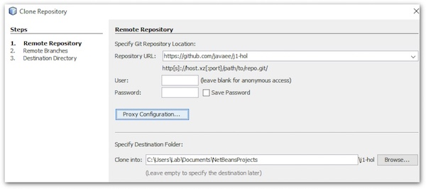
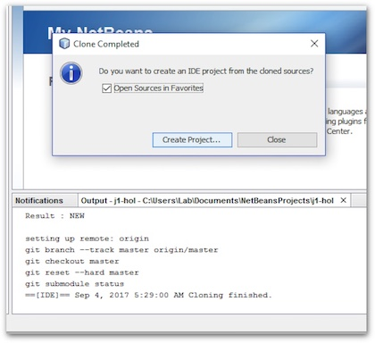

# Java EE 8 Hands On Lab

## Table of contents

* [Introduction](#introduction)
* [Initial setup](#initial-setup)
* [Exercice 1](#exercice-1)
* [Exercice 2](#exercice-2)
* [Conclusions](#conclusions)

## Introduction

*TODO!* 

## Initial setup

During the following Lab, you will use NetBeans 8.2 and GlassFish 5, the open source Java EE reference implementation. But you should be able to use any Java EE 8 compatible application server and your preferred IDE.

:bulb: Java EE 8 requires Java SE 8 or above. For JavaOne, we will use the latest JDK 8 release.

In the interest of time, NetBeans 8.2 and GlassFish have been installed and configured.

### Start NetBeans and GlassFish

In NetBeans, select *"Services"* tab, *"Servers"*, right click on the *"GlassFish 5"* instance and *"Start"* it. After a few seconds you should see that GF5 is started in the NB Output window at the bottom. You can also connect to the GF Admin console (http://localhost:4848) to confirm that GF is up and running.

:bulb: If the *"Start"* option is greyed, just wait a few seconds or select 
*"Refresh"* first.

### Clone the Lab GitHub repository

The only thing you have to do is to clone the Lab GitHub repository on your machine.

In NetBeans, choose *"Team", "Git", "Clone..." *

... and enter the URL (https://github.com/javaee/j1-hol.git) of the Lab GitHub repository to clone as below, keep the other default values.

Select *"Open Sources in Favourites"* and *"Finish"*. You can check the clone operation in the "Output" windows, the cloned repository should also appear under the *"Favourites"* tab.

You are now all set to do the exercices!

## Exercice 1

*TODO!* 

## Exercice 2

*TODO!* 

## Conlusions

*TODO!* 

